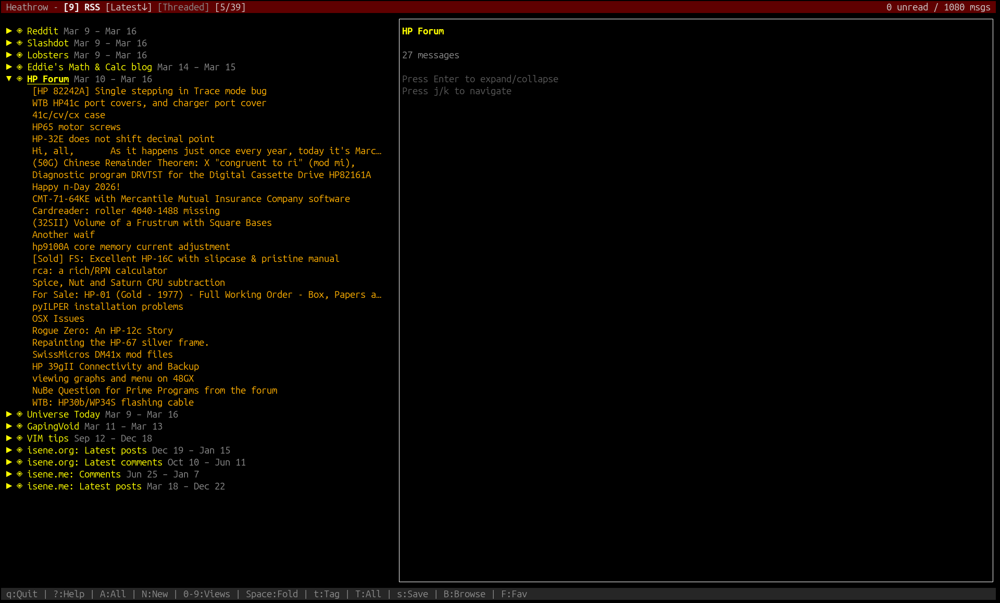
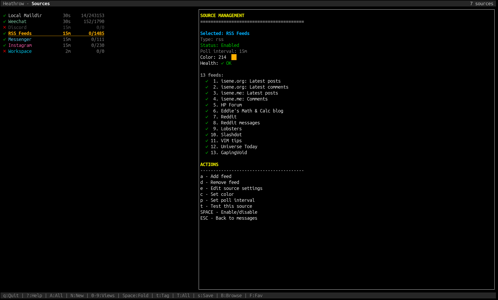

# Heathrow


**Where all your messages connect.**

 [](https://badge.fury.io/rb/heathrow)  [](docs/) 

A unified TUI for all your communication. Like Heathrow Airport, every message routes through one hub. Replace mutt, newsboat, weechat, and a dozen chat apps with one terminal interface.

## The Problem

"Dad, I sent you a message." Which app? Email? WhatsApp? Discord? Telegram? SMS? Nobody should have to chase 4-5 apps to find a message from their kid.

## The Solution

All sources in one place. Create your custom views. Full keyboard control.



## Background

In 2007 I had the idea of One Communication Hub to rule them all. Now, with Claude Code, it was efficient to realize that idea. It has now replaced [mutt](http://mutt.org/) that I've been using since 2003, my RSS readers ([newsboat](https://newsboat.org/index.html) of late) and many other apps. Heathrow now functions as my communication hub :)

## Features

**Sources** (two-way read + reply):
- Email via Maildir (works with offlineimap, mbsync, fetchmail, gmail_fetch)
- IRC/Slack via WeeChat relay
- Discord, Telegram, Instagram DMs, Messenger
- Reddit

**Sources** (read-only):
- RSS/Atom feeds
- Web page change monitoring

**Core:**
- Threaded, flat, and folder-grouped view modes
- 10+ custom filtered views with AND/OR logic
- Compose, reply, forward with address book aliases (mutt-style)
- Postpone/recall drafts
- Dynamic message loading with jump-to-date
- Hidden HTML link extraction (SharePoint, OneDrive, etc.)
- Full-text search via notmuch
- Per-source colors, per-view threading, tag/star highlighting
- RTFM file picker for attachments
- Configurable editor args, SMTP, OAuth2
- AI assistant integration (Claude Code)
- First-time onboarding wizard



## Installation

### Requirements

- Ruby >= 2.7
- [rcurses](https://github.com/isene/rcurses) gem
- sqlite3 gem

### From RubyGems

```
gem install heathrow
```

### From Source

```
git clone https://github.com/isene/heathrow.git
cd heathrow
gem install rcurses sqlite3
./bin/heathrow
```

## Quick Start

1. Run `heathrow`
2. The onboarding wizard guides you through adding your first source
3. Or press `S` to manage sources, `a` to add one

## Key Bindings

Press `?` for full help. Here are the essentials:

### Navigation
| Key | Action |
|-----|--------|
| `j`/`k` or arrows | Move up/down |
| `Enter` | Open message |
| `PgDn`/`PgUp` | Page through messages |
| `Home`/`End` | First/last message |
| `J` | Jump to date (yyyy-mm-dd) |
| `n`/`p` | Next/previous unread |

### Views
| Key | Action |
|-----|--------|
| `A` | All messages |
| `N` | New (unread) |
| `S` | Sources management |
| `0-9`, `F1-F12` | Custom filtered views |
| `G` | Cycle view mode (flat/threaded/folders) |
| `B` | Browse all folders |
| `F` | Browse favorite folders |

### Message Actions
| Key | Action |
|-----|--------|
| `r` | Reply |
| `e` | Reply with editor |
| `g` | Reply all |
| `f` | Forward |
| `m` | Compose new |
| `E` | Edit message as new |
| `R` | Toggle read/unread |
| `M` | Mark all in view as read |
| `*` | Toggle star |
| `t`/`T` | Tag message / tag all |
| `d` | Mark for deletion |
| `<` | Purge deleted |
| `x` | Open in browser |
| `v` | View attachments |
| `Y` | Copy right pane to clipboard |
| `y` | Copy message ID to clipboard |

### Compose Prompt
| Key | Action |
|-----|--------|
| `Enter` | Send |
| `e` | Edit (re-open editor) |
| `a` | Attach files (via RTFM picker) |
| `p` | Postpone (save as draft) |
| `ESC` | Cancel |

### UI
| Key | Action |
|-----|--------|
| `w` | Cycle pane width |
| `Ctrl-b` | Cycle border style |
| `D` | Cycle date format |
| `o` | Cycle sort order |
| `P` | Preferences popup |
| `?` | Help (press again for extended) |
| `q` | Quit |

## Configuration

All settings live in `~/.heathrow/heathrowrc` (Ruby syntax):

```ruby
# UI
set :color_theme,   'Mutt'
set :date_format,   '%b %-d'
set :sort_order,    'latest'
set :pane_width,    3
set :border_style,  1

# SMTP / OAuth2
set :default_email,   'you@example.com'
set :smtp_command,    '~/bin/gmail_smtp'
set :safe_dir,        '~/.heathrow/mail'
set :oauth2_script,   '~/bin/oauth2.py'
set :oauth2_domains,  %w[gmail.com]

# Identities (auto-selected by folder)
identity 'default',
  from:      'You <you@example.com>',
  signature: '~/.signature',
  smtp:      '~/bin/gmail_smtp'

# Custom views
view '1', 'Personal', folder: 'Personal'
view '2', 'Work',     folder: 'Work'
view '9', 'RSS',      source_type: 'rss'

# Favorite folders
set :favorite_folders, %w[Personal Work Archive]
```

Most settings are also available via the `P` preferences popup.

## Architecture

```
+-- Heathrow
    +-- rcurses TUI (panes, input, rendering)
    +-- SQLite database (messages, sources, views, settings)
    +-- Source plugins (maildir, rss, weechat, discord, ...)
    +-- Message organizer (threading, grouping, sorting)
    +-- Background poller (per-source sync intervals)
    +-- Composer (editor integration, address book, SMTP)
```

Each source is a self-contained plugin. Sources crash independently without affecting the core. Filters default to "show all" on failure.

## Credits

- Created by Geir Isene with [Claude Code](https://claude.ai/claude-code)
- Built on [rcurses](https://github.com/isene/rcurses) TUI library
- Inspired by [RTFM](https://github.com/isene/RTFM) file manager

## License

[Unlicense](https://unlicense.org/) - released into the public domain.
